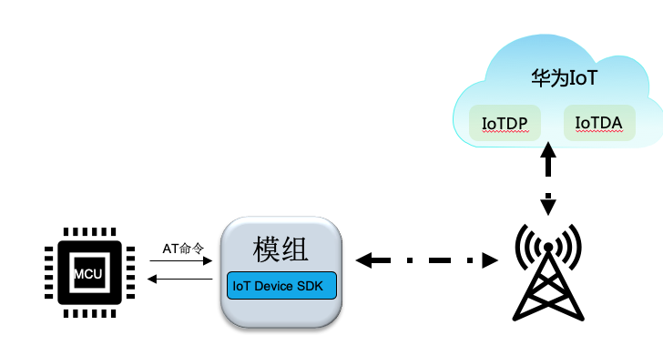
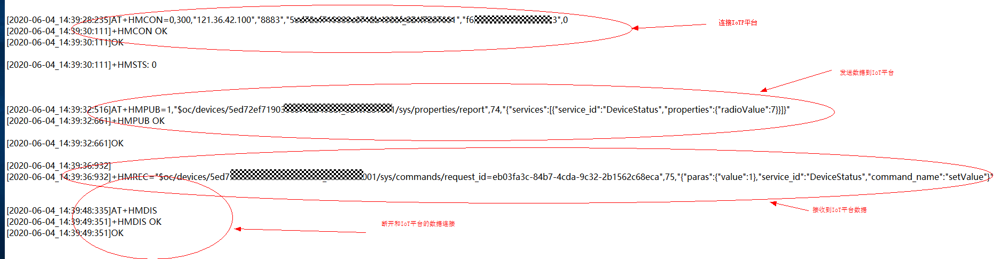
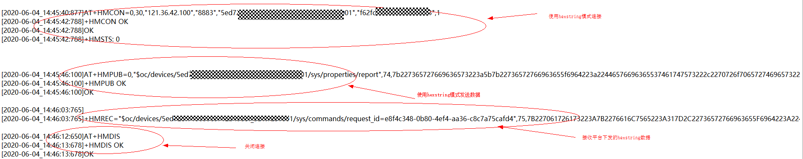

## 使用华为兼容性认证的模组接入

###  场景说明

​	    如果你使用的模组的版本经过华为认证，即该模组已经集成了对接华为IoTDA的功能，开发者可以调用该模组的AT指令对接华为IoT平台，可以节约对接工作量和周期。由于采用的是AT通道传输数据，因此传输的数据带宽受限于使用的具体模组(参考模组厂家的说明)。整体通信链路如下图所示。

​			

###  使用前置条件

​		模组内部集成的对接IoTDA功能，使用的是模组内部模组协议栈，因此必须要求模组内部协议栈可以工作，该设置不同的模组厂家的AT命令不同，可以咨询对应模组厂家；如果已经集成了华为GSL服务，则需要设置正确的工作模式即可，内部会自动完成拨号上网功能。

​		当设置好模组的上网能力之后，可以使用模组提供的指令（如PING指令）来确认模组具备上网能力；如果不能上网，需要使用相关的AT指令确认当前信号是否OK、卡是否READY。

​       另外对接IoTDA的数据有上（模组发数据给IoT平台）下（IoT平台发送数据给模组）行，务必确认模组的主动外发（URC）通道已经正确配置。

###  预置AT指令介绍

​		经过兼容性认证的模组，在AT命令以及格式规范上，基本和华为通用要求一致，部分模组厂家受限于自己的AT通道，实现稍有不同，可以参考模组厂家的特殊说明。本文以通用MQTT方式接入命令作为介绍。对于MQTT接入而言，常用的指令: 连接  发布  订阅主题  接收订阅消息 断开连接

+ 连接指令：AT+HMCON=bsmode,lifetime,serverip,serverport,deviceid,passwd,codec

​       bsmode,是否使用设备发放：0表示直接连接IoTDA,1 表示经过IoTDP连接IoTDA

​       lifetime, MQTT心跳时间

​       serverip, IoTDA的对接地址（如果使用IoTDP则为IoTDP的地址）

​       serverport, IoTDA的对接端口（如果使用IoTDP则为IoTDP的端口）

​       deviceid, 注册设备返回的设备ID

​       passwd，注册设备设置的秘钥；如果使用证书模式，该项可以设置为空，但是需要提前设置设备端的公钥以及私钥证书

​       codec, 数据传输方式：0表示是可视的ASCII码方式；1表示使用的是hexstring模式。如果是ascii模式，则数据模式一般为len,asccii_payload,比方2,"ab";如果        是hextring模式，则表示为2，“6162”； 

+ 断开连接：      AT+HMDIS

​       该指令用于主动断开和IoTDA平台的连接。在主动断开之前，模组会主动尝试重连。

+ 发布数据：AT+HMPUB=qos,topic,payload_len,payload

  qos为对应的MQTT的QOS，目前建议使用0；

​       topic，IoT平台定义的topic，需要使用者根据IoT平台规则拼接

​        payload_len, 发送数据的长度

​        payload, 发送的数据

​       务必注意payload payload_len和连接之后的codec保持一致

+ 接收数据：+HMREC:topic, payload_len, payload

  其中payload_len 和payload和连接时的codec保持一致

+ 连接断开状态：+HMSTS:status    

  status:0 表示连接成功， 1表示断开连接

  当调用连接命令成功之后，模组会尽力保持和平台的连接；如果因为网络或者其他原因导致连接断开，模组会发出status=1的消息；如果尝试连接成功，则会发出status=0的消息

+ 订阅自定义主题：AT+HMSUB=qos, topic

+ 取消自定义主题：AT+HMUNS=topic

+ 设置证书：AT+HMPKS=type, para1,[para2]

  type=0,表示平台证书，平台的PEM证书通过para1传递

  type=1,表示设备公钥证书，设备的公钥证书通过para1传递

  type=2,表示设备私钥证书，设备的私钥证书通过para1传递；如果有密码，则通过para2传输

### AT指令使用

  + 使用ASCII模式连接华为IoT平台

    

  + 使用HEXSTRING模式

    

    

  

  

  

​		

