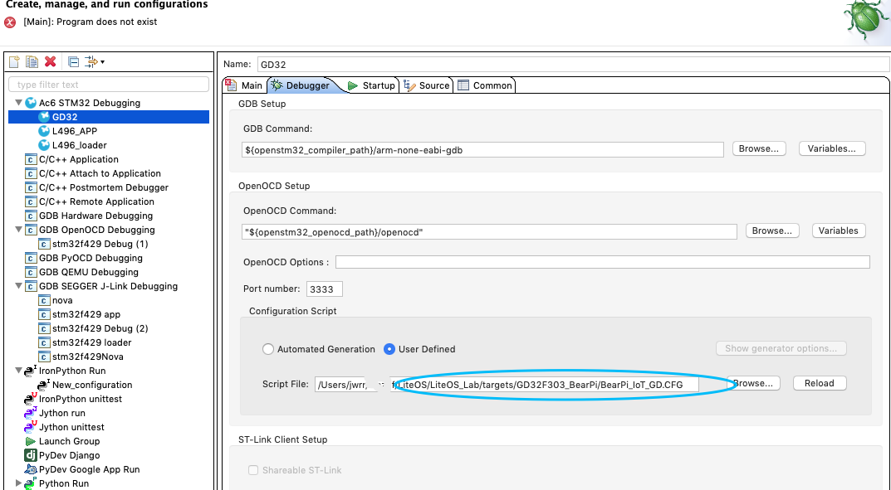

###  使用MQTT对接华为IoT

#### 对接模式

对接华为IoT模式主要有两种方式：
+ 基于已经集成的模组对接华为IoT
+ 基于IoT Device SDK软件栈对接
  关于使用AT模组对接，可以参考[模组 AT模式对接](./at.md)
  本文主要介绍使用软件栈的模式来对接。本文使用的硬件为GD32的BearPI。使用ESP8266 WIFI模组为我们提供TCPIP能力。
#### 场景说明
	本次模拟的场景为：该开发板模拟为一个记分牌；当F1 F2两个按钮代表计分，每当按下一次，该按钮对应的计数增加并上报到IoT平台；该设备接收两种命令：1，清除计分；2，控制现场的灯光的开或者关闭。
#### 创建产品模型并注册设备
  参考平台的产品开发指南，最终开发的产品模型如下图所示。

当创建好产品模型之后，基于该产品注册设备，采用秘钥模式，务必记住设备ID和密钥。

  

  至此，我们在平台上的工作已经完成。

####  配置SDK

​		当你从github获取代码之后，将tools/kconfig/Kconfiglib加入你的系统path，这样就可以在命令行使用menukconfig配置工具了。

​	    本次我们使用的esp8266wifi，因此我们必须配置为wifi的SSID以及PWD.

当配置完毕按Q键保存并退出。

需要在C代码中修改设备ID和设备秘钥为自己注册的设备。

​    修改之后，即可进入编译，如果编译没有问题，将最后编译的结果烧录进MCU。

如果你使用的是SW4ST作为你的IDE，当你下载时候，务必配置OPENOCD的配置文件，如下图所示。

​       当烧录完毕之后，我们会看到输出的LOG信息，包含我们的WIFI连接过程。

我们可以按压F1 F2观测液晶屏输出以及云平台数据变化，也可以直接从IoT平台下发数据观测开发板变化。

